# 🧘 Melo - Mental Health Journal App
[](https://pub.dev/packages/very_good_analysis)

## Getting Started
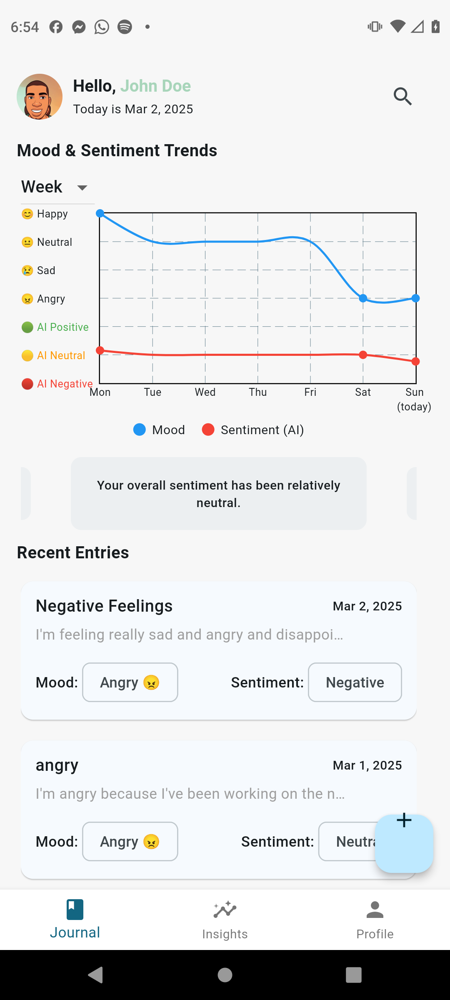


The **Melo** is a Flutter-based mental health journal mobile application designed to help users track their thoughts, emotions, and mental well-being. It provides sentiment analysis, mood tracking, and calming features like **Safe Mode** and **personalized suggestions** to encourage mindful journaling.

## ✨ Features
- 📖 **Secure Journal Entries**: Write, edit, and save personal journal entries with a rich-text editor.
- 🎭 **Mood & Sentiment Analysis**: AI-powered sentiment detection to analyze journal entries.
- 📊 **Mood Trends & Insights**: Visual analytics to track emotional trends over time.
- 🔔 **Push Notifications**: Set personalized reminders for journaling.
- 🎵 **Safe Mode**: A calming experience with breathing animations and relaxing sounds.
- 🎯 **Personalized Suggestions**: Mindfulness exercises based on journal insights.
- ☁️ **Cloud Storage**: Securely save journal entries using Firebase.

## 🛠️ Tech Stack
- **Flutter** (Dart) – Cross-platform mobile development
- **Firebase** – Authentication & cloud storage
- **Flutter Bloc** – State management
- **Flutter WorkManager** – Background tasks for reminders
- **Flutter Local Notifications** – Push notification handling
- **TensorFlow Lite / NLP** – Sentiment analysis
- **SQLite** – Local data storage

## 📦 Installation
To run this project locally:

1. **Clone the repository**
   ```sh
   git clone https://github.com/tsounguc/mental-health-journal-app.git
   cd mental-health-journal-app
   ```

2. **Install dependencies**
   ```sh
   flutter pub get
   ```

3. **Configure Firebase**
    - Create a Firebase project at [Firebase Console](https://console.firebase.google.com/)
    - Download `google-services.json` (Android) and `GoogleService-Info.plist` (iOS)
    - Place them in the respective **android/app** and **ios/Runner** directories

4. **Run the app**
   ```sh
   flutter run
   ```

## 🚀 Usage
- **Start Journaling**: Tap the ✚ Floating Action Button to create a new entry.
- **Check Your Mood**: View your sentiment analysis results and track mood trends.
- **Enable Safe Mode**: Double-tap the Floating Action Button or enable it after negative sentiment detection.
- **Get Personalized Suggestions**: See mood-based recommendations for mindfulness exercises.
- **Set Reminders**: Schedule daily journaling reminders through settings.

## 📜 Roadmap
- ✅ MVP Completed (Journal entries, sentiment analysis, insights, safe mode, push notifications)
- 📅 Future Enhancements:
    - Multi-device sync with Firebase
    - AI-generated journal prompts
    - Dark mode & theme customization
    - Web and Desktop support (Flutter Web)

## 🤝 Contributing
Contributions are welcome! Here's how you can contribute:
1. **Fork the repo** 🍴
2. **Create a feature branch**: `git checkout -b feature-idea`
3. **Commit changes**: `git commit -m "Added new feature"`
4. **Push to GitHub**: `git push origin feature-idea`
5. **Open a Pull Request** ✅

## 📜 License
This project is licensed under the MIT License.

## 🙌 Acknowledgments
Special thanks to:
- Flutter & Firebase communities
- Mental health awareness initiatives 💙

## 🎬 Screenshots

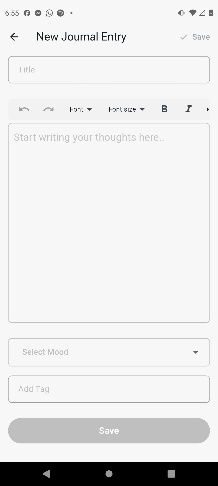
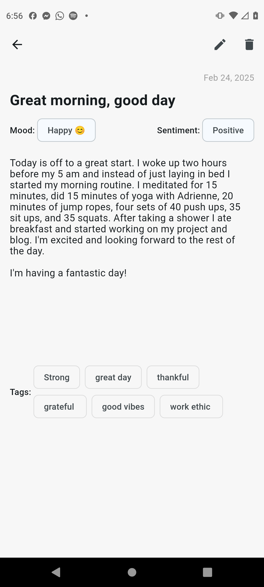
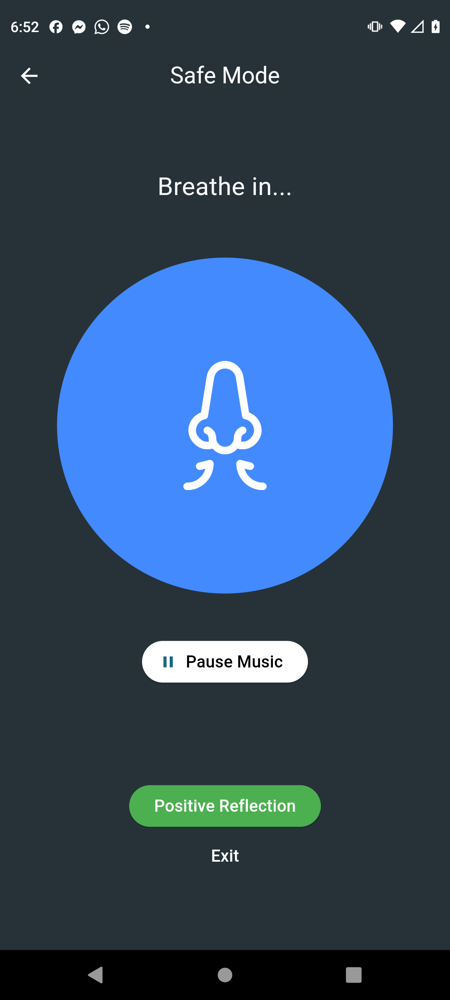
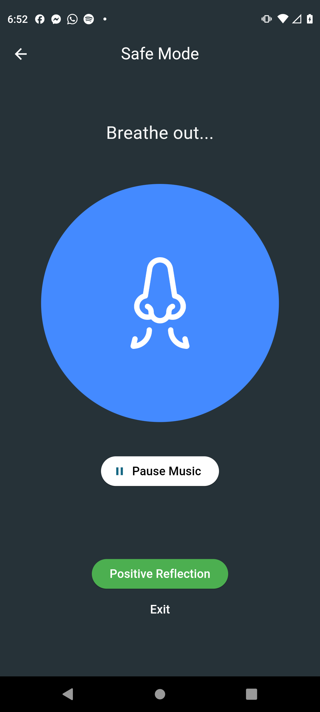
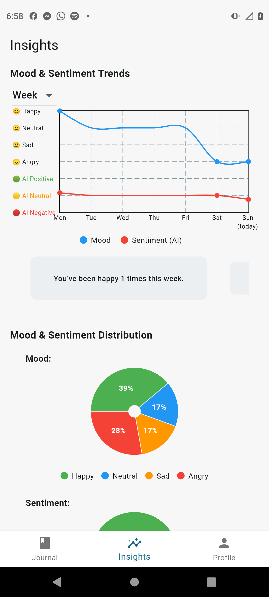
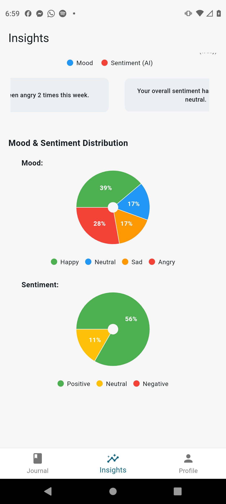
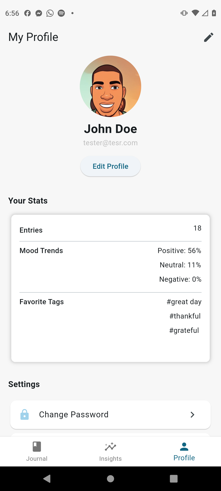
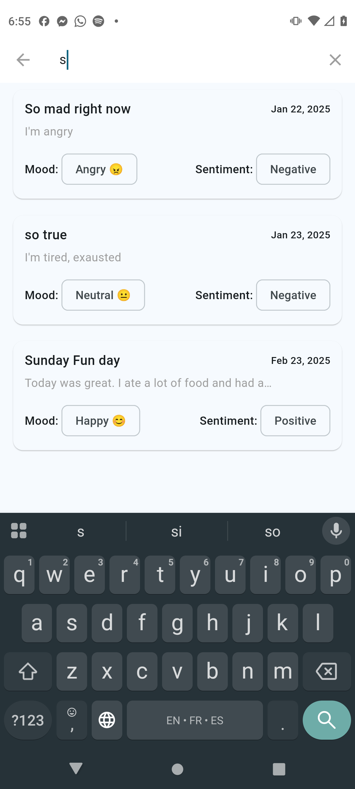
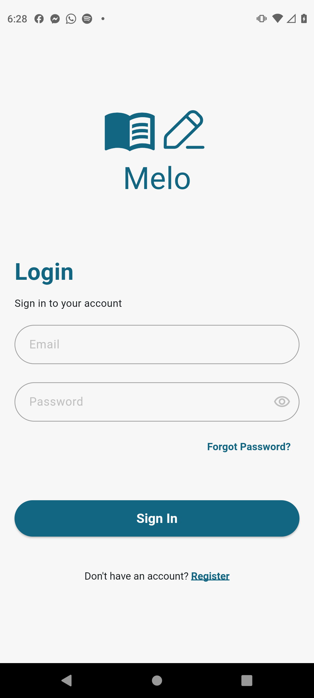
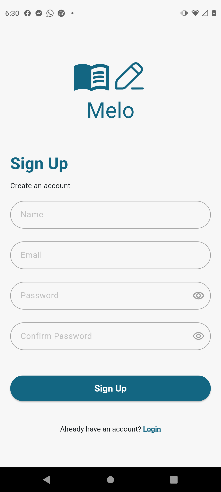